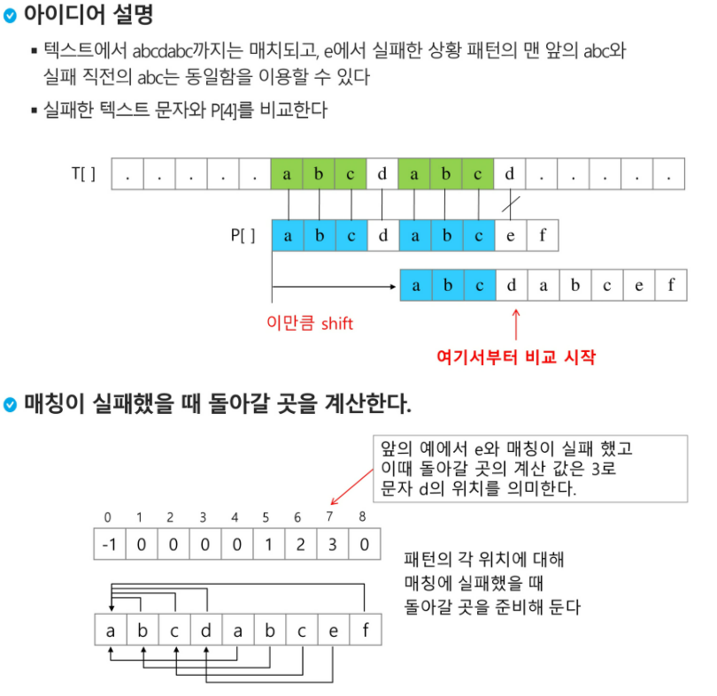

# day20

## 문자열


### 패턴 매칭

* 고지식한 패턴 검색 알고리즘
* 카프-라빈 알고리즘
* KMP 알고리즘
* 보이어-무어 알고리즘


### 고지식한 패턴 검색 알고리즘

* 본문 문자열을 처음부터 끝까지 차례대로 순회하면서 패턴 내의 문자들을 일일이 비교하는 방식으로 동작

* ```python
  p = "is"						# 찾을 패턴
  t ="This is a book~!"			# 전체 텍스트
  M =len(p)						# 찾을 패턴의 길이
  N=len(t)						# 전체 텍스트 길이
  
  def BruteForce(p, t):
      i = 0
      j = 0   					
      while i < N and j < M:
          if t[i] != p[j]:		
              i = i-j				# 검색위치 쉬프트
              j = -1
        	i = i + 1				# 검색위치를 1칸 푸쉬
          j = j + 1				# 0 으로 만들어서 검색할 처음으로
      if j == M: return i - M		# 검색 성공
      else: return -1 			# 검색 실패
  ```

  


---

### KMP 알고리즘

* 불일치가 발생한 텍스트 스트링의 앞 부분에 어떤 문자가 있는지를 미리 알고 있으므로, 불일치가 발생한 앞 부분에 대하여 다시 비교하지 않고 매칭을 수행
* 패턴을 전처리하여 배열 next[M]을 구해서 잘못된 시작을 최소화함
  * next[M] : 불일치가 발생했을 경우 이동할 다음 위치
* 


---

### 보이어-무어 알고리즘

* 오른쪽에서 왼쪽으로 비교
* 대부분의 상용 소프트웨어에서 채택
* 오른쪽 끝에 있는 문자가 불일치하고 이문자가 패턴 내에 존재하지 않을 경우, 이동거리는 패턴의 길이만큼 이동


* 문자열 매칭 알고리즘 비교
  * 

