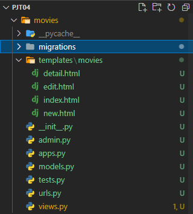
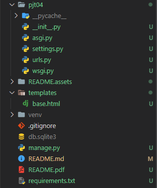

# Project_04

## 프레임워크 기반 웹 페이지 구현

### 1.목표

* 데이터를 생성, 조회, 수정, 삭제할 수 있는 Web application 제작
* Django web framework를 통한 데이터 조작
* ORM(Object Relational Mapping)에 대한 이해
* 관리자 페이지를 통한 데이터 관리


## A. 프로젝트 구조

```
pjt04/은 startproject 명령어로 생성되는 project 디렉토리입니다.
movies/는 startapp 명령어로 생성되는 application 디렉토리입니다.
```




```
위의 순서대로 project를 생성하고 app을 생성하여 구조에 맞게 필요한 부분들은 추가하여 뼈대를 구성

project를 생성할때 위치에 유의하며 설치
$ django-admin startproject pjt04 .  <<= 이부분

전체적인 구조를 만드는 것은 어렵지않았음
settings.py 의 언어와 시간을 한국에 맞춰서 설정하고 생성한 app을 INSTALLED_APPS 에 추가해준다.
```


## B. Model

```html
정의할 모델 클래스의 이름은 Movie이며, 다음과 같은 정보를 저장합니다. 생성/
수정시간과 같은 timestamp는 선택 사항입니다.
필드명 		자료형			   설명
title 	      String(<= 100)   제목
overview	  Text             줄거리
poster_path   String(<= 500)   포스터 경로
```

```
난 timestamp 까지 추가했다.
하지만 처음에는 강의때 사용한 Question Model을 사용해서 Migrate 했기때문에 설정을 수정했다. 
Movie와 필드로 수정한 후 다시 시작. 타입의 max_length 설정도 해준다.
```


## C. Admin

```html
위에서 정의한 모델 Movie는 관리자 페이지에서 데이터의 생성, 조회, 수정, 삭제 가능해야 합니다.
```

```
admin.py에 위에서 만든 Model을 등록하여 admin페이지에서 Movie를 관리할 수 있게 설정 
python manage.py creatsuperuser을 통해 관리자 등록

이부분은 django에서 제공해주는 부분이기 때문에 쉽게 설정가능
```


## D. URL

```
URL 패턴 				   설명
/movies/new/ 			새로운 영화 작성 Form
/movies/create/ 		영화 데이터 저장
/movies/ 				전체 영화 목록 조회
/movies/<pk>/ 			단일 영화 상세 조회
/movies/<pk>/edit/ 		단일 영화 수정 Form
/movies/<pk>/update/ 	수정된 영화 데이터 저장
/movies/<pk>/delete/ 	단일 영화 삭제
```

```
app_name = 'movies'
# /movies/ + 
urlpatterns = [
     path('new/', views.new, name='new'),
     path('create/', views.create, name='create'),
     path('', views.index, name='index'),
     path('<int:pk>/', views.detail, name='detail'),
     path('<int:pk>/edit/', views.edit, name='edit'),
     path('<int:pk>/update/', views.update, name='update'),
     path('<int:pk>/delete/', views.delete, name='delete'),
]

pk 기본기가 필요한 부분들은 int를 이용해서 항목을 불러올 수 있게 설정
```


## E. View & Template

```
i. 공유 템플릿 생성 및 사용 
1. 모든 HTML파일은 base.html을 확장(extends)하여 사용합니다. 
2. base.html은 모든 페이지가 공유하는 상단 네비게이션 바를 표시합니다. 
3. 네비게이션 바는 전체 영화 목록 조회 페이지와 새로운 영화 작성 페이지로
   이동할 수 있는 링크를 포함합니다.
```

```
base.html 에서 body 부분에 nav 설정

<body>          
  <nav class="nav">
    <a class="nav-link active" href="">INDEX</a>
    <a class="nav-link" href="">NEW</a>      
  </nav>   
  <div class="container">  
    
    
  </div>  
</body>

모든페이지긴 하지만 index 페이지와 new 페이지만 가능하다. 
create, edit, update, delete 는 따로 페이지를 필요로 하지 않기 때문에 추가하지 않았음
그리고 container로 지정해서 밑에 들어올 content 들을 안쪽에 위치 시켰음

처음에는 블록안에 nav 바를 넣어줬는데 그러니깐 오작동해서 밖으로 빼냈다. 
이해한걸로는 block content에 index와 new 같은 내용들이 들어오는것 같음
```

```
ii. 전체 영화 목록 조회
1. 데이터베이스에 존재하는 모든 영화의 목록을 표시합니다.
2. 사용자에게 응답으로 제공할 HTML파일은 index.html 입니다.
3. index.html은 base.html을 확장합니다.
4. index.html에는 적절한 HTML요소를 사용하여 제목을 표시하며, 제목을
   클릭 시 해당 영화의 상세 조회 페이지로 이동합니다.
```

```
index.html



  <h1>index</h1>
  <ul>
    
    <li>    
    <a href="">{{ movie.title }}</a>
    </li>
    
  </ul>  


block content 안에 전체 영화를 표시하고 <a> 를 통해 detail 링크를 걸어줌
```

```
iii.새로운 영화 작성 Form
1. 사용자에게 응답으로 제공할 HTML파일은 new.html입니다.
2. new.html은 base.html을 확장합니다.
3. 영화를 작성할 수 있는 Form을 표시하며, 다음과 같은 input 요소들을 포함해야 합니다.
필드명       HTML 요소   Type
title       input      text
overview    textarea   없음
poster_path input      text
4. Form에 작성한 정보는 제출(submit)시, 영화 데이터를 저장하는 URL로 요청과 함께 전송됩니다.
```

```
new.html



<h1>New movies</h1>
<form action="" method="POST">
  
  <div>
    <label for="title">제목:</label>
    <input name="title" id="title" type="text">
  </div>
  <div>
    <label for="overview">줄거리:</label>
    <textarea name="overview" id="overview" cols="30" rows="10"></textarea>
  </div>
  <div>
    <label for="poster_path">포스터 경로:</label>
    <input name="poster_path" id="poster_path" type="text">
  </div>
  <div>
    <button>제출</button>
  </div>
</form>


new 페이지에서 제목과 줄거리 포스터 경로를 입력하고 제출 버튼을 누르면 create 를 통해 생성된다.
name을 설정하지않아 오류가 발생하여서 오류를 해결하는데 좀 걸렸다.
```

```
iv. 영화 데이터 저장
1. 요청과 함께 전송된 데이터를 데이터베이스에 저장합니다.
2. 저장이 완료되면 아래의 동작 중 하나를 선택하여 수행합니다.
A. 전체 영화 목록 조회 페이지로 Redirect합니다.
B. 저장한 영화의 상세 조회 페이지로 Redirect합니다.
```

```
def create(request):
    title = request.POST.get('title')
    overview = request.POST.get('overview')
    poster_path = request.POST.get('poster_path')
    movie = Movie(title=title, overview=overview, poster_path=poster_path)    
    movie.save()
    return redirect('movies:detail', movie.pk)

B 설정을 통해서 상세조회인 detail로 redirect 설정한다.
```

```
v. 단일 영화 상세 조회
1. URL을 통해 함께 전달된 pk에 해당하는 영화 상세정보를 HTML에 표시해야 합니다.
2. 사용자에게 응답으로 제공할 HTML은 detail.html입니다.
3. detail.html은 base.html을 확장합니다.
4. detail.html에는 적절한 HTML 요소를 사용하여, 조회하는 영화의 제목, 
   줄거리, 포스터 이미지를 표시합니다
```

```


<h3>{{ movie.title }}</h3>
<p>{{ movie.overview }}</p>
<p>{{ movie.poster_path }}</p>
<p>{{ movie.created_at }}</p>
<p>{{ movie.updated_at }}</p>
<hr>
<div>
  <a href="">
    <button>수정</button>
  </a>
</div>
<form action="" method="POST">
  
  <button>삭제</button>
</form>


detail 부분은 pk 기본키를 받아와서 해야하는거기때문에 views.py 부분에서
pk에 따른 정보들을 저장하고
html 에서 불러온다.
수정과 삭제 버튼을 추가해서 해당 pk 의 데이터를 조작할 수 있게 설정
```

```
vi. 추가기능
1. 단일영화 정보를 수정하고 삭제하는 기능을 추가합니다.
```

```
# Update
## 데이터를 제풀할 기존 내용이 있는 html 제공
def edit(request, pk):
    movie = Movie.objects.get(pk=pk)  
    context = {
        'movie': movie,
    }
    return render(request, 'movies/edit.html', context)

## 사용자가 제출한 데이터를 기존 movie에 저장
def update(request, pk):
    movie = Movie.objects.get(pk=pk)    
    movie.title = request.POST.get('title')
    movie.overview = request.POST.get('overview')
    movie.poster_path = request.POST.get('poster_path')
    movie.save()
    return redirect('movies:detail', movie.pk)
    
# Delete
## 기존 movie을 삭제
def delete(request, pk):
    movie = Movie.objects.get(pk=pk)  
    if request.method == "POST":        
        movie.delete()
        return redirect('movies:index')
    else:
        return redirect('movies:detail', movie.pk)
        
수정과 삭제는 해당부분의 pk를 통해서 데이터를 조작한다.
수정시 수정된 사항을 다시 edit으로 보내고 
삭제시 index.html로 넘어가게 redirect 해준다.
```


```
프로젝트를 마치며
전체적으로 이번주 했던 내용을 복습하는 느낌이였다. 그래도 아직까지 흐름이 익숙하지 않아서 왔다갔다 거린다.
이번 프로젝트는 전체적인 뼈대만 만드는 느낌이였고 데이터를 가져오고 전체적인 form 을 만들게 된다면
더 재미있을것 같다.
```

