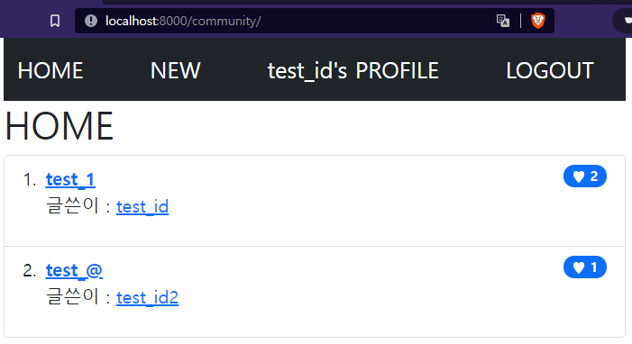
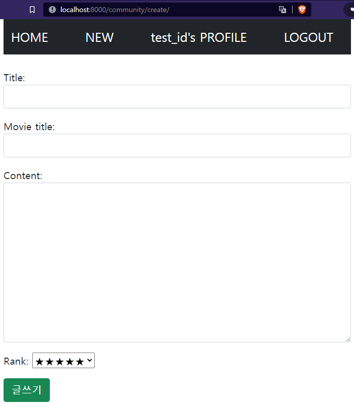
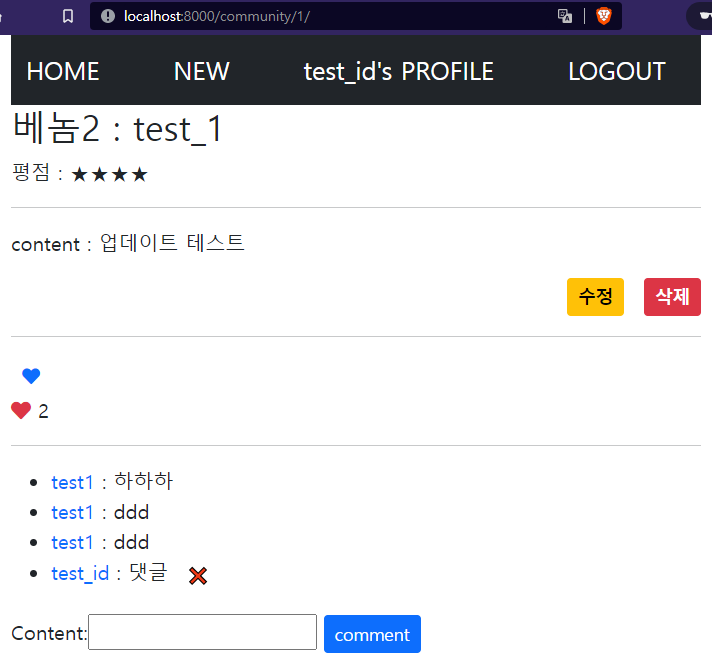
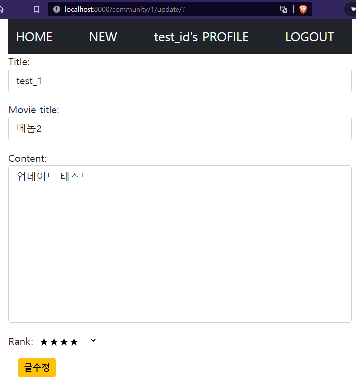
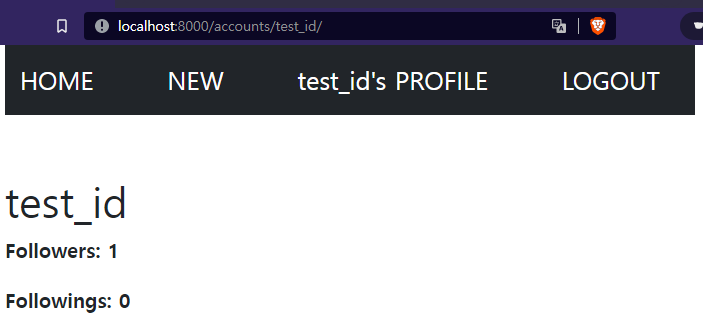
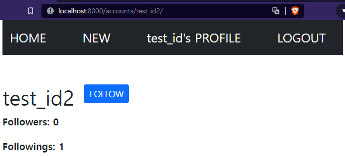
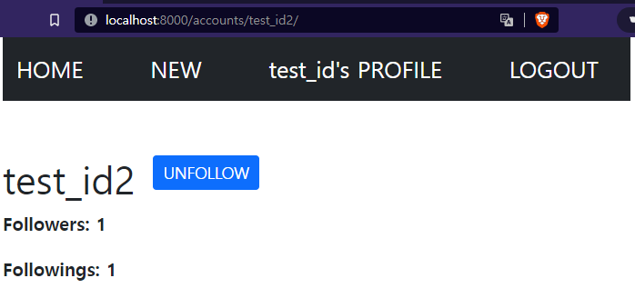

# pjt07

## Intro

```
박준영:
이번 프로젝트는 이때까지 했던 django의 모든 내용과 LIKE 와 FOLLOW 및 댓글 기능을 추가하였다. 다하고 선택사항까지 포함하여 완성하였고 마지막으로 bootstrap을 사용해서 스타일링 하였다. 양이 너무많아서 코드를 복사하고 흐름을 파악하는데 집중했음. 어려웠던점은 각각의 관계들을 통해서 요소를 가져오는데 필요한 명령어들이 익숙하지 않아서 그부분은 따로 다시 공부해야할 것 같다. 처음 django를 할때는 거의 따라쓰기 수준이였는데 어느정도 이해가 된 상황에서 프로젝트를 진행하니 반이상은 이해하고 가는중이다.
```


## Project

### B. Model

```python
# accounts/models.py
from django.db import models
from django.contrib.auth.models import AbstractUser


class User(AbstractUser):
    followers = models.ManyToManyField('self', symmetrical=False, related_name='followings')
```

```python
# community/models.py
from django.db import models
from django.conf import settings


class Review(models.Model):
    RANKS = [
        (1, '★'),
        (2, '★★'),
        (3, '★★★'),
        (4, '★★★★'),
        (5, '★★★★★'),
    ]    
    user = models.ForeignKey(settings.AUTH_USER_MODEL, on_delete=models.CASCADE)
    title = models.CharField(max_length=100)
    movie_title = models.CharField(max_length=50)
    rank = models.IntegerField(choices=RANKS, default=5)
    content = models.TextField()
    like_users = models.ManyToManyField(settings.AUTH_USER_MODEL, related_name='like_reviews')
    created_at = models.DateTimeField(auto_now_add=True)
    updated_at = models.DateTimeField(auto_now=True)

    def __str__(self):
        return f'{self.title}'


class Comment(models.Model):
    user = models.ForeignKey(settings.AUTH_USER_MODEL, on_delete=models.CASCADE)
    review = models.ForeignKey(Review, on_delete=models.CASCADE)
    content = models.CharField(max_length=200)

    def __str__(self):
        return f'{self.content}'
```


### C. Form

```python
# accounts/fomrs.py
from django import forms
from django.contrib.auth import get_user_model
from django.contrib.auth.forms import UserCreationForm

User = get_user_model()
class CustomUserCreationForm(UserCreationForm):

    class Meta:
        model = User
        fields = ('username',)
```

```python
# community/forms.py
from django import forms
from .models import Review, Comment


class ReviewForm(forms.ModelForm):
    title = forms.CharField(
        widget=forms.TextInput(attrs={'class':'form-control'})
    )
    movie_title = forms.CharField(
        widget=forms.TextInput(attrs={'class':'form-control'})
    )
    content = forms.CharField(
        widget=forms.Textarea(attrs={'class':'form-control'})
    )
    
    class Meta:
        model = Review
        fields = ('title', 'movie_title', 'content', 'rank',)

class CommentForm(forms.ModelForm):
    content = forms.CharField(
        min_length=2,
        max_length=200,
        widget=forms.TextInput(attrs={'autofocus': True})
    )
    class Meta:
        model = Comment
        fields = ('content', )
```


### D. URL

```python
# urls.py
from django.contrib import admin
from django.urls import path, include

urlpatterns = [
    path('admin/', admin.site.urls),
    path('accounts/', include('accounts.urls')),
    path('community/', include('community.urls')),
]
```

```python
# accounts/urls.py
from django.urls import path
from . import views

app_name = 'accounts'
urlpatterns = [
    path('signup/', views.signup, name='signup'),
    path('login/', views.login, name='login'),
    path('logout/', views.logout, name='logout'),
    # 프로필 페이지
    path('<str:username>/', views.profile, name='profile'),
    # 팔로우 기능
    path('<str:username>/follow/', views.follow, name='follow'),
]
```

```python
# community/urls.py
from django.urls import path
from . import views

app_name = 'community'
urlpatterns = [
    # index ~ 리뷰 구현
    path('create/', views.create_review, name='create_review'),
    path('', views.review_index, name='review_index'),
    path('<int:review_pk>/', views.review_detail, name='review_detail'),
    path('<int:review_pk>/update/', views.update_review, name='update_review'),
    path('<int:review_pk>/delete/', views.delete_review, name='delete_review'),
    
    # 좋아요
    path('<int:review_pk>/like/', views.like_review, name='like_review'),

    # 댓글기능(작성, 삭제)
    path('<int:review_pk>/comments/create/', views.create_comment, name='create_comment'),
    path('<int:review_pk>/comments/<int:comment_pk>/delete/', views.delete_comment, name='delete_comment'),
]
```


### E. View & Template

```python
# accounts/views.py
from django.shortcuts import render, redirect, get_object_or_404
from django.views.decorators.http import require_safe, require_POST, require_http_methods
from django.contrib.auth import get_user_model
from django.contrib.auth import login as auth_login, logout as auth_logout
from django.contrib.auth.forms import AuthenticationForm
from .forms import CustomUserCreationForm

User = get_user_model()

@require_http_methods(['GET', 'POST'])
def signup(request):
    if not request.user.is_authenticated:
        if request.method == 'POST':
            form = CustomUserCreationForm(request.POST)
            if form.is_valid():
                user = form.save()
                auth_login(request, user)
                return redirect('community:review_index')
        else:
            form = CustomUserCreationForm()
        context = {'form': form, }
        return render(request, 'accounts/signup.html', context=context)
    else:
        return redirect('community:review_index')

        
@require_http_methods(['GET', 'POST'])
def login(request):
    if not request.user.is_authenticated:
        if request.method == 'POST':
            form = AuthenticationForm(request, request.POST)
            if form.is_valid():
                user = form.get_user()
                auth_login(request, user)
                return redirect(request.GET.get('next') or 'community:review_index')
        else:
            form = AuthenticationForm()        
        context = {'form': form, }
        return render(request, 'accounts/login.html', context=context)
    else:
        return redirect(request, 'community:review_index')


def logout(request):
    auth_logout(request)
    return redirect('community:review_index')


# 프로필 페이지
@require_safe
def profile(request, username):
    profile = get_object_or_404(User, username=username)
    is_following = profile.followers.filter(pk=request.user.pk).exists()
    context = {
        'profile': profile, 
        'is_following': is_following,
    }
    return render(request, 'accounts/profile.html', context)


# 팔로우 기능
@require_POST
def follow(request, username):
    follower = request.user
    following = get_object_or_404(User, username=username)
    if follower.followings.filter(pk=following.pk).exists():
        follower.followings.remove(following)
    else:
        follower.followings.add(following)
    return redirect('accounts:profile', following.username)
```

```python
# community/views.py
from django.shortcuts import render
from django.shortcuts import render, redirect, get_object_or_404
from django.views.decorators.http import require_safe, require_POST, require_http_methods
from django.contrib.auth.decorators import login_required
from .models import Review, Comment
from .forms import ReviewForm, CommentForm


@login_required
@require_http_methods(['GET', 'POST'])
def create_review(request):
    if request.method == 'POST':
        form = ReviewForm(request.POST)
        if form.is_valid():
            review = form.save(commit=False)
            review.user = request.user
            review.save()
            return redirect('community:review_detail', review.pk)
    else:
        form = ReviewForm()
    context = {
        'form': form,
    }
    return render(request, 'community/create.html', context)


@require_safe
def review_index(request):
    reviews = Review.objects.all()      
    context = {
        'reviews': reviews,
    }
    return render(request, 'community/index.html', context)


@require_safe
def review_detail(request, review_pk):
    review = get_object_or_404(Review, pk=review_pk)
    form = CommentForm()
    context = {
        'review': review,
        'form': form,
    }
    return render(request, 'community/detail.html', context)


@login_required
@require_http_methods(['GET', 'POST'])
def update_review(request, review_pk):
    review = get_object_or_404(Review, pk=review_pk)
    if request.user == review.user:
        if request.method == 'POST':
            form = ReviewForm(request.POST, instance=review)
            if form.is_valid():
                review = form.save()
                return redirect('community:review_detail', review.pk)
        else:
            form = ReviewForm(instance=review)
        context = {
            'form': form,
            'review': review,
            }
        return render(request, 'community/update.html', context)
    else:
        return redirect('community:review_detail', review_pk)


@login_required
@require_POST
def delete_review(request, review_pk):
    review = get_object_or_404(Review, pk=review_pk)
    if request.user == review.user:
        review.delete()
    return redirect('community:review_index')


# 좋아요
@login_required
@require_POST
def like_review(request, review_pk):
    review = get_object_or_404(Review, pk=review_pk)
    if review.like_users.filter(pk=request.user.pk).exists():
        review.like_users.remove(request.user)  # 취소
    else:
        review.like_users.add(request.user)  # 추가
    return redirect('community:review_detail', review.pk)


# 댓글 작성
@require_POST
def create_comment(request, review_pk):
    if request.user.is_authenticated:
        review = get_object_or_404(Review, pk=review_pk)
        form = CommentForm(request.POST)
        if form.is_valid():
            comment = form.save(commit=False)
            comment.review = review
            comment.user = request.user
            comment.save()
        return redirect('community:review_detail', review.pk)


# 댓글 삭제
@login_required
@require_POST
def delete_comment(request, review_pk, comment_pk):
    review = get_object_or_404(Review, pk=review_pk)
    comment = get_object_or_404(Comment, pk=comment_pk)
    if request.user == comment.user:
        comment.delete()
    return redirect('community:review_detail', review.pk)

```

1. INEDX

   

   

2. DETAIL/UPDATE

   

   

   

3. PROFILE(My, Others)

   

   

   

