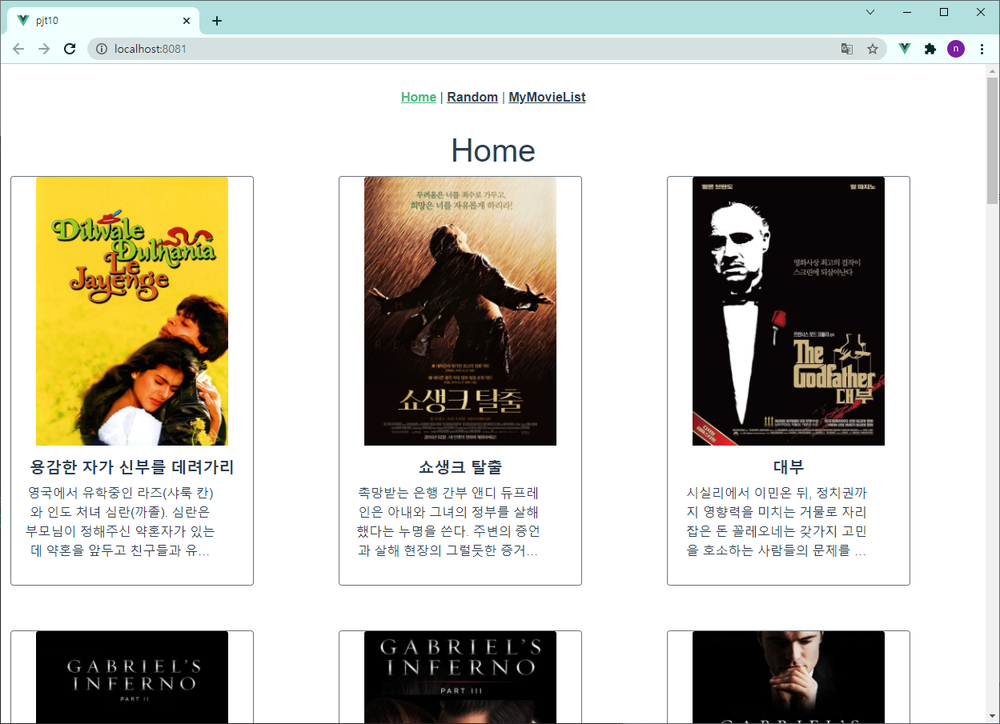
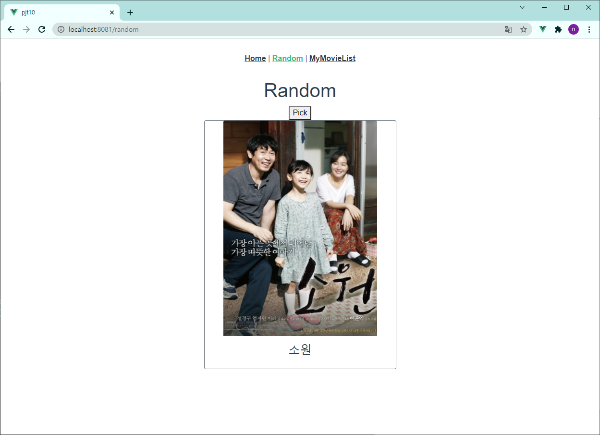
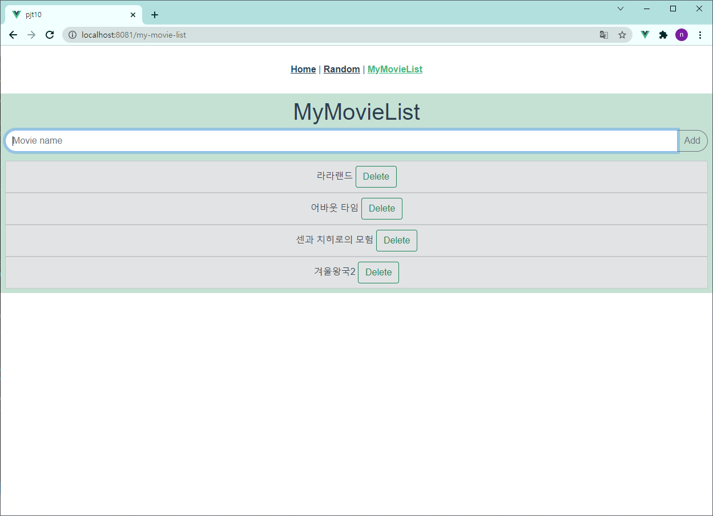

### [신전떡볶이 순한맛╰(*°▽°*)╯]

# PJT10🍕

# 총평

- 마지막 관통 프로젝트!

 

- 박--
  - 이번주에 배운내용들로 vuex를 이용해서 만들어보기는 했는데 이해하는데 조금 오래걸린다. 일단 전체적인 틀은 완성되었고 기능도 구현하였다.
  -  그다음인 css 과정에서 줄거리를 몇줄까지 나오게 설정하고 뒷부분은 생략하게 해주는 ellipsis 를 사용해서 카드안에 설정해줬음. 그리고 한줄에 몇장의 카드가 나올지 설정하는데도 이전 javascript 할때와는 다른 형식으로 넣어줘야해서 전체적인 흐름을 이해하는데 도움이 되었음.
  - 전체적으로 천천히 한다는 생각으로 하면 시간은 걸리겠지만 완성은 할 수 있을지도...

 

- 조---
  - Vuejs를 배운 내용들을 총 복습하는 느낌이라서 시험이나 최종프로젝트를 앞두고 유익한 관통프로젝트였다!!!
  - 처음 영화 이미지 출력하는 부분, 그리고 랜덤 영화 추천에서 영화 제목을 뽑는 부분이 가장 시간이 많이 걸리고 헤맸던 것 같다.
  - 최종프로젝트 페어로 --님과 함께 하게 되었는데 프로젝트를 같이 하는 건 처음이었어서 어떤 느낌일지 대충 경험해볼 수 있었다,

 

# 목표

> - 영화 정보를 제공하는 SPA 제작
> - AJAX통신과 JSON 구조에 대한 이해
> - Single File Component 구조에 대한 이해
> - vue-cli, vuex, vue-router 등 플러그인 활용

 

# 준비사항

> A. 언어
>
> ​	i. Node.js LTS version
>
> ​	ii. Vue.js 2.X
>
> B. 도구
>
> ​	i. Visual Studio Code 
>
> ​	ii. Chrome Browser 
>

 

# 요구사항

> 컴포넌트 구조

 

# 프로젝트

 

## 1. Home.vue

- 관리자 페이지에서 Actors, Movies, Reviews 를 모두 추가, 수정, 삭제할 수 있도록 구현했다.

 

## 2. Random.vue

#### 랜덤 영화 정보

- 버튼을 누르면 20개의 영화 중 1개의 영화를 출력할 수 있도록 했다.

 

## 3. MyMovieList.vue

#### 보고싶은 영화를 기록해두는 페이지

- 영화 제목 입력 후 엔터나 Add 버튼을 누르면 아래에 기록하고, Delete버튼을 통해 삭제할 수 있도록 했다.
